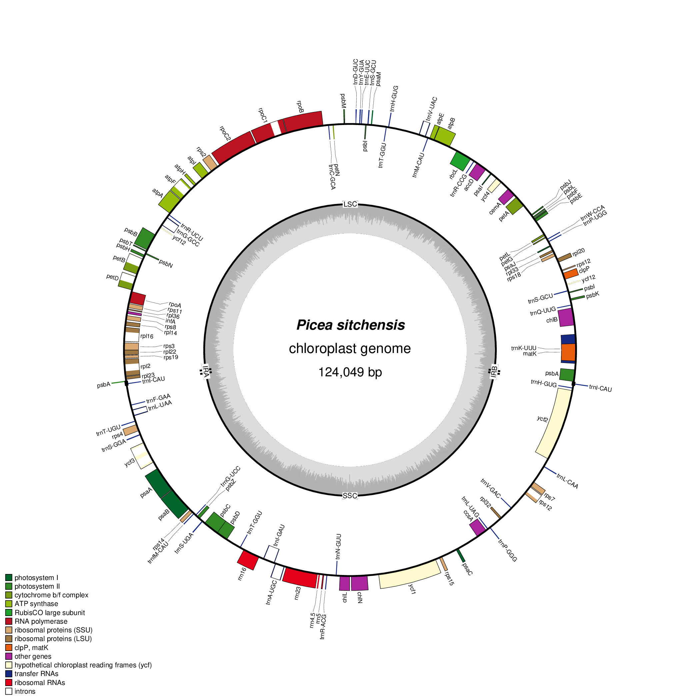

# Plastid genome of Sitka spruce (*Picea sitchensis*)

# Methods

We annotated the coding (mRNA) and non-coding (rRNA and tRNA) genes of Sitka spruce (*Picea sitchensis*, KU215903) using MAKER 2.31.8 [@Campbell_2013]. The gene sequence of Norway spruce (*Picea abies*, NC_021456.1) [@Nystedt_2013] were used as evidence for MAKER. This automated annotation missed six difficult-to-annotate genes, which we annotated manually, based on visualization of the aligned evidence using IGV 2.3.80 [@Robinson_2011]. The gene *matK* is found inside the intron of *trnK-UUU*. The genes *rpl22* and *rps3* overlap, as do *psbC* and *psbD*. One copy of the gene *psbA* is truncated and annotated as a pseudogene. The gene *trnI-GAU* is not annotated by MAKER for some unknown reason. The gene *rps12* is trans-spliced [@Hildebrand_1988]. MAKER annotated 12 introns and missed three due to short initial exons of length 6, 8 and 9 bp in the genes *petB*, *petD* and *rpl16*, which we annotated manually as above. We identified introns that are group II self-splicing ribozymes using RNAweasel [@Lang_2007]. We annotated open reading frames using Prodigal 2.6.2 [@Hyatt_2010]. We aligned the complete genomes of white spruce (*Picea glauca*, KT634228.1) [@Jackman_2015] and Norway spruce to Sitka spruce using BWA-MEM 0.7.15 [@Li_2013] to investigate the conservation of chlorolplast gene synteny between these three closely-related species. We identified the two-copy inverted repeat typical of genomes using MUMmer 3.23 [@Kurtz_2004].

# Results

Sitka spruce retains perfect gene synteny both white spruce and Norway spruce. All 114 genes are found in the same copy number and in the same order in Sitka spruce as is observed in white spruce and Norway spruce, including 74 coding genes, 4 ribosomal RNA (rRNA) and 36 transfer RNA (tRNA) genes.

The 15 introns seen in white spruce and Norway spruce are also found in Sitka spruce, with 9 found in coding genes and 6 in tRNA. Of these 15 introns, 12 are group II self-splicing ribozymes identified by RNAweasel, which are common in plastid genomes. One additional group II intron is found upstream of exon 2 of the trans-spliced gene *rps12*, consistent with [@Hildebrand_1988], though not included formally in this annotation due to the difficulty in identifying the 5' coordinate of the intron without additional transcript evidence. It is unclear whether the three introns not annotated as group II, found in the genes *petD*, *trnL-UAA* and *trnI-GAU*, is due to a lack of sensitivity in RNAweasel or a splicing mechanism other than a group II self-splicing ribozyme.

We identify 14 open reading frames (ORFs), 13 of which are larger than 150 bp, and 4 of which are larger than 300 bp.

The two-copy inverted repeat of Sitka spruce is 440 bp, the same size as Norway spruce, and slightly smaller than the 445 bp inverted repeat of white spruce. The inverted repeat of Norway spruce has perfect sequence identity between the two copies. White spruce observed a single nucleotide mismatch between its two copies. Unusually, Sitka spruce has three nucleotide mismatches between its two copies.
